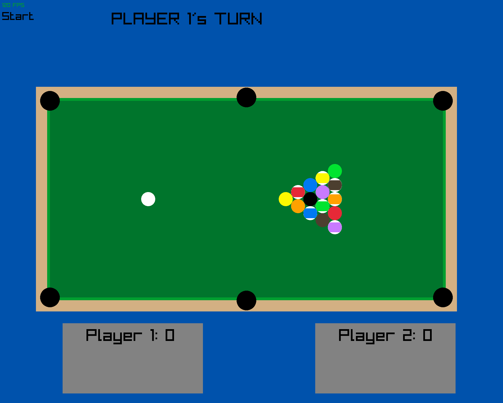

simple pool game using C and raylib



useful build info - https://github.com/raysan5/raylib/blob/master/projects/CMake/README.md

used physics from https://www.youtube.com/watch?v=ThhdlMbGT5g
[code from video](https://github.com/matthias-research/pages/blob/master/tenMinutePhysics/03-billiard.html)

another useful video - https://www.youtube.com/watch?v=guWIF87CmBg

# Build locally
```
cd build
cmake ..
cmake --build .
```

# Build for Web
```
cd build/web
emcmake cmake ../.. -DPLATFORM=Web
emmake make
```

#Run wen build locall
```
emrun --browser "/mnt/c/Program Files/Google/Chrome/Application/chrome.exe" pool.html
```

TODO:
* add max power and scale distance dragged back when hitting q ball
* menu options of of inelastic collisions are
* add sound
* randomize balls starting positon in triangle
* add cpu?
* add 2nd player online?
* change math to be in m/s and have drawing map to pixels
* make AirHockey mode?
* added numbers to balls and have balls rotate?
